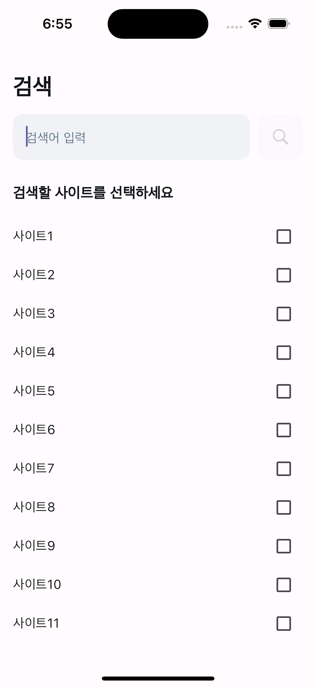

# neutral_search

중립적인 정보 검색

## 프로젝트 설명

현대 사회에서는 방대한 정보에 쉽게 접근할 수 있게 되었습니다. 그러나 필터 버블(Filter Bubble) 현상으로 인해 사회 문제나 현상에 대해 객관적으로 판단하기 어려운 상황이 발생하고 있습니다. 이 앱은 동일한 검색어를 입력하더라도 다양한 성향의 사이트에서 얻은 검색 결과를 최대한 반영하여 상반된 의견을 접할 수 있는 기회를 제공합니다. 이를 통해 사용자들이 보다 중립적이고 합리적인 판단을 내릴 수 있도록 돕습니다.